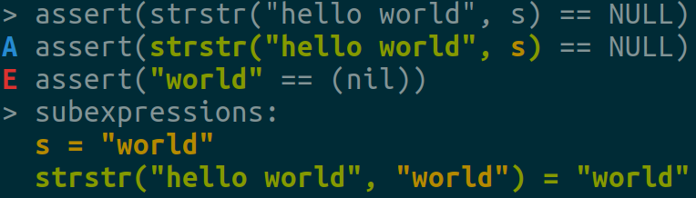

Assert Introspection
====================

(WIP) GCC plugin that rewrites ``assert`` s to provide introspection about the inner expressions,
for C (and possibly C++). No code changes required!

Originally, concepts were take from how ``pytest`` does it, but later on I took my way.

*This was developed & tested with GCC 9.2.0 / 9.1.0 / 7.5.0*

TL;DR
-----

When ``assert(1 != n && n != 6)`` fails, you get this print before aborting::

    In file myfile.c:42, function 'test_function':
    > assert(1 != n && n != 6)
    A assert((n != 1) && (n != 6))
    E assert((...) && (6 != 6))
    > subexpressions:
      n = 6

* The first line is the original expression text, as was written in your code.
* The second line (starting with ``A``) is the expression code, recreated from AST. Macros will be
  missing, and the expression might be modified a bit by GCC.
* The third line (starting with ``E``) is the evaluated expression, printed as it failed. Here we'll see the
  exact values leading to the failure.
* The last section is "subexpressions", where we'll see the relation between certain sub-expressions
  in the ``assert`` (such as variables) with their values.

Function calls and strings inside the ``assert`` are also displayed nicely::

    // s is "42"

    > assert(strtol(s, NULL, 0) == 5)
    A assert(strtol(s, (nil), 0) == 5)
    E assert(42 == 5)
    > subexpressions:
      s = "42"
      strtol("42", (nil), 0) = 42

Oh, and it's colorful:

Using it
--------

.. code-block:: bash

   git clone --depth 1 https://github.com/Jongy/gcc_assert_introspect.git
   cd gcc_assert_introspect

   # install GCC plugin-dev, required to build GCC plugins.
   # on Ubuntu, you'll need gcc-X-plugin-dev, where X is your GCC major.
   # For Ubuntu 18.04 that will be:
   sudo apt-get install gcc-7-plugin-dev

   # builds, then runs tests with your local GCC
   make test
   # if everything passes, you're good to go!

Then just add ``-fplugin=/path/to/gcc_assert_introspect/assert_introspect.so`` to your CFLAGS
in your project. All files compiled with the plugin will have their ``assert`` s rewritten.

.. note:: The plugin inserts calls to ``printf``, ``sprintf`` and ``abort`` - their declarations
          are required and you'll get a compilation error if you fail to include relevant headers
          ``stdio.h``, ``stdlib.h``.

.. warning:: If you see ``internal compiler error`` when compiling with the plugin, it's probably
             to blame.
             It's still WIP, after all :) Not all expressions are supported (yet), you can
             see the list of TODOs below.

Why did I write this
--------------------

I always preferred the short and concise ``assert(...)`` statements (as opposed to the cumbersome
assert-equal, assert-less-than, assert-string-equal etc most C/C++ unit test libraries have).
And not just for writing tests - ``assert`` s placed in regular code are very helpful to catch
problems, and in many projects I use them extensively, especially during early development,
when they are very likely to fail... :) However, often seeing them trigger is just not enough to
pinpoint the problem.
So you are required to change the code, add some prints and reproduce the problem if you
want to know what went wrong.

I'm really tired of doing that (especially of converting ``assert`` s which have side effects to
equivalent ``printf`` s, then having to convert them back when the problem is solved...)

``pytest`` solved it nicely with their assert introspection. When an introspected ``assert`` fails
in ``pytest``, it prints the values of all sub-expressions in the main assert expression. For
example, when the following ``assert`` fails::

    assert min([1, 2, 3]) - 5 + min(1, 2, 3) == max([5, 6, 5])

``pytest`` prints::

    >       assert min([1, 2, 3]) - 5 + min(1, 2, 3) == max([5, 6, 5])
    E       assert ((1 - 5) + 1) == 6
    E        +  where 1 = min([1, 2, 3])
    E        +  and   1 = min(1, 2, 3)
    E        +  and   6 = max([5, 6, 5])

Very neat. I want that in C.

How
---

``pytest`` does that by rewriting Python's AST (see a brief covering of it here_). This way, the
asserted expression can be written naturally by the user, and after parsing into AST it can be
rewritten as they please to add the extra information.

.. _here: https://pybites.blogspot.com/2011/07/behind-scenes-of-pytests-new-assertion.html

In my case, since I want the expressions to be written naturally in C, we'll have to do something
similar - rewrite the AST.
C is not a dynamic language like Python, so the AST can't be patched in runtime, it must be changed
during compilation. This can be done by writing a GCC plugin that'll patch the AST during
compilation.

Examples & Tests
----------------

``python3 -m pip install -r tests/requirements.txt`` then run with ``make test``. They'll compile some test programs
and check their output. You can use it to verify your local GCC is okay with the plugin.

To see some examples, you cat ``cat tests/tests.log`` after you run the tests. The output
of all failed ``assert`` s is kept.

TODOs
-----

* Expressions we currently don't know how to parse & repr are printed as "..." in the AST repr.
* Relate subexpression strings to values. We already relate variables and results of function calls,
  others might be useful as well (for example, results of arithmetics?)
* Get rid of redundant parenthesss (specifically, since all expressions are binary,
  a (... || ... || ...) expression is really ((.. || ..) || ..) and will be displayed such. But
  usually the code is written without the extra parentheses).
* Test it on some real projects :D
* Make it generic - not tied to glibc's ``assert``.
* Subtraction of consts is represented by ``PLUS_EXPR`` with a negative ``INTEGER_CST``, handle
  it nicely.
* Handle array references and arrays in general.
* Handle struct accesses.
* More binary ops - & ^ | etc.
* Prefix/postfix inc/dec ops.
* Casts are displayed on variables, but not on function calls / binary expression results.

See the plugin code for more information.
